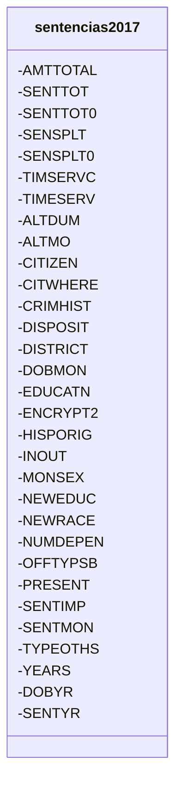
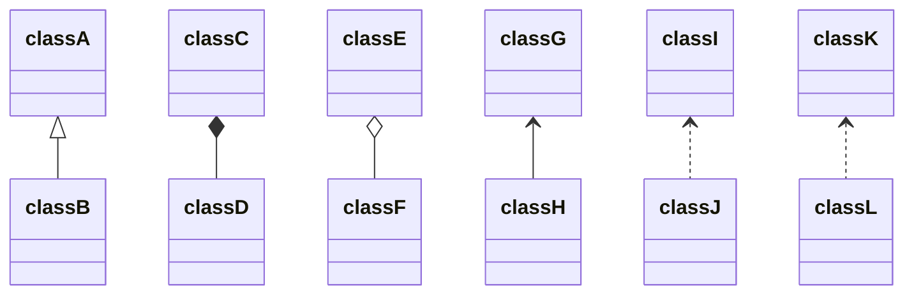
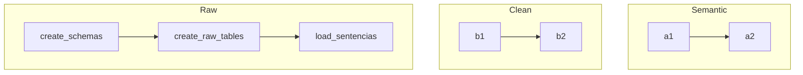

# INDIVIDUAL OFFENDER DATASET


***

## Generalidades
**Información de Contacto:**


+ Pinto Veizaga Daniela, github username: [dapivei](https://github.com/dapivei)     
+ Rodríguez Sánchez Elizabeth, [erodriguezul](https://github.com/erodriguezul)
+ Muñoz Sancen Maggie,  [maggiemusa](https://github.com/maggiemusa)
+ Cadavid Sánchez Sebastían, [C1587S](https://github.com/C1587S)

**Procedimiento:**
<div align="justify">

- [x] Crear el repositorio OffenderDS.
- [x] Crear estructura de carpetas para un proyecto en python, duplicado del *template* generado por [navdepp](https://github.com/navdeep-G/samplemod)
-   [x] Escoger una fuente de datos: [Sentencing Commision DataSets](https://github.com/khwilson/SentencingCommissionDatasets), desarrollado por `Kevin Wilson`.
-   [x] Crear un README.md: Describir la fuente de datos. Describir la entidad, estructura de la base de datos, pipeline, instalación, ejecución.
-   [x] Cargar la base de datos a raw
-   [x] Crear una versión limpia en cleaned
-   [x] Crear el esquema semantic
-   [ ] Crear features temporales ligados a la entidad dadas las fechas del evento. Guardarlos en el esquema features.
</div>

**Índice:**

1. [ Propósito del Proyecto. ](#PROP)
2. [ Descripción del problema: sobrepoblación de las cárceles.](#SOBRE)
3. [ Supuestos Básicos. ](#SUP)
4. [ Guía Replicabilidad. ](#REPLI)

***
<a name="PROP"></a>
## 1. Propósito del proyecto
<div align="justify">

**1.1. Objetivo general:** emplear técnicas y herramientas de machine learning para predecir la tasa de encarcelamiento en los distintos distritos de Estados Unidos. La predicción sería a un plazo de 5, 10 y 15 años. *En este etapa del proyecto aún no se genera la predicción; únicamente se genera y procesa la información necesaria y de utilidad de la base de datos "sentencias.csv" para en un futuro próximo proceder con el cruce de la información con datos relevantes como ser: capacidad carcelaria de los distintos distritos de Estados Unidos, presupuesto necesario para la cobertura de las necesidades básicas de los encarcelados, entre otros aspectos.*

**1.2. Objetivo inmediato:** generar la estructura de trabajo necesaria para cargar y analizar la base de datos por medio de consultas de tablas relevantes para la predicción futura. Para ello, se emplea bash, python, sql y PostgreSQL.


**1.3. Sentencing Commision DataSets:** compilada por la Comisión de Sentencias de Estados Unidos (USSC, por sus siglas en inglés) y dispuesta en un formato procesado por Kevin Wilson en [Sentencing Commision DataSets](https://github.com/khwilson/SentencingCommissionDatasets), cuya unidad observacional es la `sentencia`. En específico, a través de la base de datos dispuesta por Kevin Wilson se pueden consultar, por año fiscal, de delincuentes que fueron sentenciados:


+ culpables de todos los cargos;
+ de acuerdo con las directricez de la USCC.

No incluye sentencias relativas a:

+ acusados corporativos;
+ apelaciones;
+ acusados que NO fueron culpables de todos los cargos.

*Para esta etapa del proyecto, **únicamente emplearemos la base de datos correspondiente al año fiscal 2017**, misma que cuenta con `65,534` registros de sentencias.*

<a name="SOBRE"></a>
## 2. Descripción del problema: sobrepoblación de las cárceles.

<div align="justify">

El encarcelamiento masivo en Estados Unidos ha conllevado serios problemas, incluidos, la sobrepoblación en las prisiones.

El incremento de prisioneros y la falta de capacidad de albergamiento degenera problemas de salubridad, socioecómicos los cuáles inevitablemente se traducen en presiones presupuestales en los diversos Estados para cubrir con los requerimientos mínimos de control y gestión de los diversos aspectos de la vida de los reclusos: seguridad, comida, oportunidades educativas y recreacionales, mantenimiento de la infraestructura, costos de las fa

La sobrepoblación en las cárceles es un problema que se comparte en distintas latitudes. Para Elías Carranza, ésta acontece cuando “la densidad peniten- ciaria es mayor que 100, porque hay más personas presas que la capacidad establecida para una prisión o para la totalidad del sistema”.22 Para medir la sobrepoblación, es necesario conocer la capacidad instalada de los estable- cimientos penitenciarios, es decir, los espacios destinados para albergar a la población reclusa (camas útiles), y posteriormente establecer la relación con el total de las personas privadas de la libertad.


</div>

<center>

**Gráfica 1.Tasa de Encarcelamiento Mundial**

<p align="center">
  <image width="600" height="400" src="https://github.com/C1587S/OffenderDS/blob/master/imagenes/map_incarceration_rate.png">
</p>

Referencia: Imágen tomada de [World Population Review](http://worldpopulationreview.com/countries/incarceration-rates-by-country/).
</center>


<a name="SUP"></a>
## 3. Supuestos Básicos


-En la realización de este proyecto partimos de un supuesto básico: cada registro, correspondiente a las sentencias emitidas en un año fiscal determinado, corresponden a uno y SOLO UNO acusado. Es decir, más de una sentencia en un mismo año no puede corresponder al mismo acusado. Con ese supuesto inicial, pero necesario para hechar a andar el *workflow* de trabajo.

-Dia primero sentencing_date


<a name="REPLI"></a>
## 4. Guía Replicabilidad


<div align="justify">

La _Comisión de Sentencias de Estados Unidos_ (_USSC_, por sus siglas en inglés), una agencia independiente del órgano judicial, realiza un reporte anual donde incluye todas las sentencias resueltas en el sistema federal judicial.

Desde su origen, en 1984, el USCC tiene como misión de promoción de la unicidad en las sentencias emitidas en el sistema federal; entre las múltiples políticas que se implementaron desde su constitución, se encuentra la emisión de _líneas directricez_ para las sentencias (_sentencing guidelines_); y, la colección, análisis e investigación de información relacionada con crimen federal y problemas de sentencias. De esta manera, la información recolectada por la _USCC_  es la fuente de información primaria relativa al crimen federal y temas relacionados a las sentencias.

En el sitio [Sentencing Commision DataSets](https://github.com/khwilson/SentencingCommissionDatasets), **Kevin Wilson** dispone las bases de datos, por año fiscal, de delincuentes que fueron:

+ sentenciados, culpables de todos los cargos;
+ en seguimiento de las directricez de la USCC.

No incluye sentencias:

+ relativas a acusados corporativos;
+ apelaciones;
+ relativas a acusados que NO fueron culpables de todos los cargos.

<div align="center">






</div>


*Tabla 1. Entities*


<br />
<div align="center">

| Tipo de Variable    | Variable Asociada   | Descripción                            |
| ------------------- | ------------------- | -------------------------------------- |
| Entidad             | offender            | Identifcador del acusado               |
| Estado              | status              | ¿El acusado se encuentra en la cárcel? |
| Periodo de Estado   | duration            | Tiempo en la cárcel                    |
| Variables Estáticas | country_citizenship | País de ciudadanía                     |
| Variables Estáticas | birth_month         | Mes de nacimiento del acusado          |
| Variables Estáticas | birth_year          | Año de nacimiento del acusado          |
| Variables Estáticas | genre               | Género del acusado                     |
| Variables Estáticas | race                | Raza del acusado                       |


```sql

jkdjskajdlska

```


<center>
</center>


<div align="justify">

**4.0** Carga de base de Datos


**4.1** Inicializar vagrant:

```
vagrant up
vagrant ssh
```

**4.2** Crear la base de datos en SQLite

Una vez situados en la carpeta donde tenemos el csv con la información a cargar.

```
➜  ~ cd /
➜  / cd data/sentencias
```
Una vez ahí, vemos que nuestro cursor ha cambiado a `➜  sentencias` . Ahora creamos la base sentencias.db

` sqlite3 sentencias.db`

Con esto, vemos que el cursor cambia a `sqlite>`
Importamos el csv que hemos preparado:

```
sqlite> .mode csv
sqlite> .separator ","
sqlite> .import sentencias2017.csv sentencias2017
sqlite> .tables
sqlite> .schema
sqlite>
```
Con esto podemos actualizar el archivo
create\_raw\_tables.sql ubicado dentro de la carpeta data/sentencias.

Usamos Ctrl + D para salir de SQLite

el cursor vuelve a ser `➜  sentencias`.

##Creación de base de datos en PostgreSQL

Cambiamos al usuario postgres

```
sudo su postgres
```

Tecleamos `psql` para iniciar el cliente de base de datos.

`psql`

Con esto, el cursor ha cambiado a `postgres=#`.

Ahora creamos la base de datos sentencias, junto con el rol, al que asignamos los permisos necesarios:

```
create database sentencias;
create role sentencias login;
alter role sentencias with encrypted password 'sentencias';
grant all privileges on database sentencias to sentencias;
```
Para ver los roles actualmente creados en el servidor postgres usamos:

`postgres=# \du+`

Usamos Ctrl + D, dos veces para volver a vagrant. El cursor es de nuevo `➜  sentencias`

##Ambiente virtual
Ahora crearemos en ambiente virtual. Tecleamos:

```
pyenv virtualenv 3.7.3 sentencias
echo 'sentencias' > .python-version
```
Nuestro cursor ahora ha cambiado a `(sentencias) ➜  sentencias`.

###Instalación de librerías

```
curl -sSL https://raw.githubusercontent.com/sdispater/poetry/master/get-poetry.py | python
source $HOME/.poetry/env
poetry init
poetry add toml
poetry add click
poetry add psycopg2
poetry add dynaconf
```

##Creación de esquemas y tablas raw
 Ya que hemos actualizado el archivo sentencias.py, lo llamamos para crear los esquemas y tablas raw, mismas que poblamos :

```
python sentencias.py
python sentencias.py create-schemas
python sentencias.py create-raw-tables
python sentencias.py create-raw-tables
python sentencias.py load-sentencias
```
Nos conectamos a la base de datos desde vagrant:

```
psql -U sentencias -d sentencias -h 0.0.0.0 -W
```

Consultamos los esquemas creados:

```
\dn
```
Verificamos las tablas creadas:

```
sentencias-> \dt raw.
```
Verificamos que hay información en la tabla:

```
 select * from raw.sentencias2017 limit 3;
```

Salimos con `Q`

Salimos de postgres (`Ctrl+D`) para comenzar la carga de *cleaned*

```
 python sentencias.py to-cleaned
```


</div>
