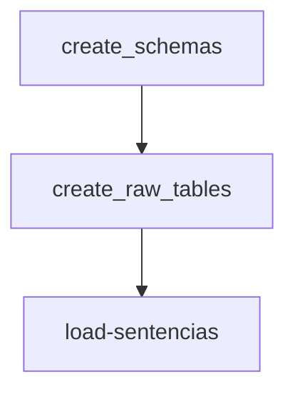

# Individual Offender Dataset

Instrucciones para el Proyecto Final de `Programación para Ciencia de Datos`:

-   [x] Crear un repositorio
-   [x] Crear estructura de carpetas para un proyecto en python
-   [x] Escoger una fuente de datos
-   [x] Crear un README.md: Describir la fuente de datos. Describir la entidad, estructura de la base de datos, pipeline, instalación,ejecución.
-   [x] Cargar la base de datos a raw
-   [x] Crear una versión limpia en cleaned
-   [ ] Crear el esquema semantic
-   [ ] Crear features temporales ligados a la entidad dadas las fechas del evento. Guardarlos en el esquema features
-   [ ] La cantidad, esquema de semantic, de la cantidia
-   [ ]

* * *

| Integrantes                 | Github Username                                 |
| --------------------------- | ----------------------------------------------- |
| Pinto Veizaga Daniela       | [dapivei](https://github.com/dapivei)           |
| Rodríguez Sánchez Elizabeth | [erodriguezul](https://github.com/erodriguezul) |
| Muñoz Sancen Maggie         | [maggiemusa](https://github.com/maggiemusa)     |
| Cadavid Sánchez Sebastían   | [C1587S](https://github.com/C1587S)             |

***

## PROPÓSITO DEL PROYECTO

Por medio del presente trabajo se busca predecir el

## INTRODUCCIÓN

La _Comisión de Sentencias de Estados Unidos_ (_USSC_, por sus siglas en inglés), una agencia independiente del órgano judicial, realiza un reporte anual donde incluye todas las sentencias resueltas en el sistema federal judicial.

Desde su origen, en 1984, el USCC tiene como misión de promoción de la unicidad en las sentencias emitidas en el sistema federal; entre las múltiples políticas que se implementaron desde su constitución, se encuentra la emisión de _líneas directricez_ para las sentencias (_sentencing guidelines_); y, la colección, análisis e investigación de información relacionada con crimen federal y problemas de sentencias. De esta manera, la información recolectada por la _USCC_  es la fuente de información primaria relativa al crimen federal y temas relacionados a las sentencias.

En el sitio [Sentencing Commision DataSets](https://github.com/khwilson/SentencingCommissionDatasets), **Kevin Wilson** dispone las bases de datos, por año fiscal, de delincuentes que fueron:

+ sentenciados, culpables de todos los cargos;
+ en seguimiento de las directricez de la USCC.

No incluye sentencias:

+ relativas a acusados corporativos;
+ apelaciones;
+ relativas a acusados que NO fueron culpables de todos los cargos.

## PREGUNTA PREDICTIVA

## GUÍA PARA REPLICABILIDAD

1.  Nombre del Repositorio: `OffendersDS`.
2.  Estructura de carpetas para un proyecto de python:

-   Dataset original: [United States Sentencing Commission Individual Offender Data Sets](https://kevinhayeswilson.com/data.html).
*Tabla 1. Entities*

| Tipo de Variable    | Variable Asociada   | Descripción                            |
| ------------------- | ------------------- | -------------------------------------- |
| Entidad             | offender            | Identifcador del acusado               |
| Estado              | status              | ¿El acusado se encuentra en la cárcel? |
| Periodo de Estado   | duration            | Tiempo en la cárcel                    |
| Variables Estáticas | country_citizenship | País de ciudadanía                     |
| Variables Estáticas | birth_month         | Mes de nacimiento del acusado          |
| Variables Estáticas | birth_year          | Año de nacimiento del acusado          |
| Variables Estáticas | genre               | Género del acusado                     |
| Variables Estáticas | race                | Raza del acusado                       |

# Carga de Datos

